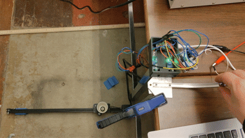
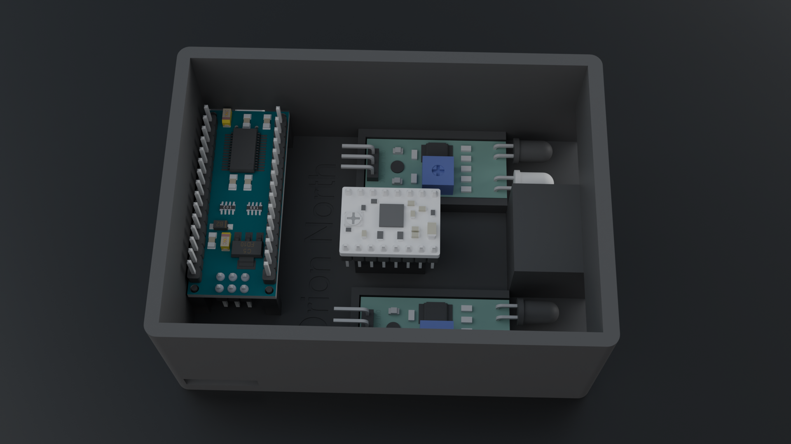

# CatchBOT
## Senior Templeton STEM Project #1
*By: Orion North & Aidan Ho*

- The CatchBOT project challenges students to create a robot to catch a ball rolling off of the edge of a table using kinematics and arduino. Our solution involves a linear rail driven by a stepper which moves a cup to a position determined by IR sensors.
- **Our system consists of the following hardware:**
    - Arduino Nano Microcontroller
    - **2x** Flying Fish IR Sensor
    - A4988 Stepper Motor Driver
    - NEMA 17 Stepper Motor
    - X-Axis Rail from decomissioned Ender 5 3D printer
    - Misc. Components (Wires, capacitors, etc.)
- **The robot was created using the following software stack:**
    - PlatformIO to compile and upload code to arduino
    - C++ for all code
    - Autodesk Fusion Education Edition for CAD
    - Blender for renders
- Notes
    - We did not use a library for driving the stepper as it adds additional overhead and we only need simple control of an individual motor
    - Stepper is running at 24V with an approx 0.8A phase current
    - Robot can currently catch consistently at short distances as shown below (~80% of the time) but requires further tuning for longer distances + higher speed

